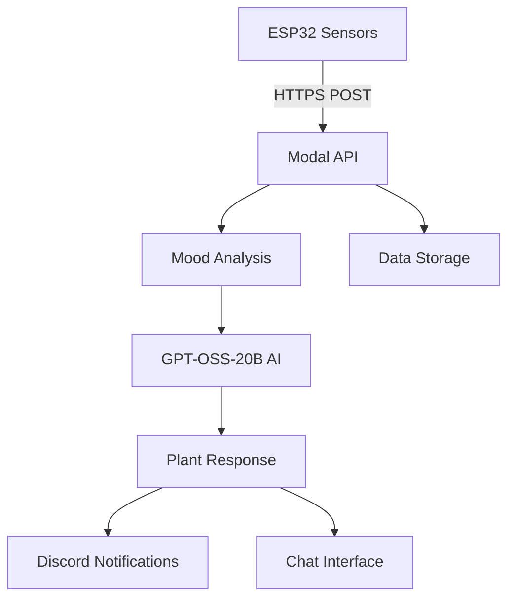

# Plant-Pal 🌱
**OpenAI Open Model Hackathon - Smart Plant Care Assistant**

An AI-powered plant monitoring system that uses ESP32 sensors and GPT-OSS models to create an interactive plant companion. Your plants can now communicate their needs, chat with you, and send notifications through Discord!

## Project Overview

Plant-Pal transforms plant care through intelligent sensor monitoring and AI-driven personality. Using the `gpt-oss-20b` model, plants gain unique personalities and can express their needs in natural language based on real-time environmental data.

### Key Features
- **Real-time sensor monitoring** (soil moisture, temperature, humidity)
- **AI plant personality** powered by GPT-OSS-20B
- **Interactive chat** with your plants
- **Mood-based care recommendations** (different moods)
- **Discord notifications** with automatic monitoring
- **notification channel** (Discord)
- **REST API** for hardware integration
- **ESP32 compatible** with HTTPS support
  
## Quick Start

### Deploy the API
```bash
modal deploy plant_backend.py
```

After deployment, your API is live at:
```
https://uta2025hackathon--plant-backend-fastapi-app.modal.run
```

### Start Discord Monitoring (Recommended)
```bash
# Activate virtual environment
source venv/bin/activate

# Start automatic Discord notifications (polls every 10 seconds)
python discord_plant_monitor.py
```

### Test with Random Data
```bash
# Send random sensor data to test different moods
python random_plant_data.py

# Or auto-generate data continuously
python auto_random_data.py
```

### Test the API

#### 1. Health Check
```bash
curl https://uta2025hackathon--plant-backend-fastapi-app.modal.run/health
```

#### 2. Send Sensor Data
```bash
curl -X POST https://uta2025hackathon--plant-backend-fastapi-app.modal.run/sensor-data \
  -H "Content-Type: application/json" \
  -d '{
    "plant_id": "my_plant_001",
    "soil_moisture": 25.0,
    "temperature": 22.0,
    "humidity": 50.0
  }'
```

#### 3. Get Plant Status
```bash
curl https://uta2025hackathon--plant-backend-fastapi-app.modal.run/plant/my_plant_001/status
```

#### 4. Chat with Your Plant
```bash
curl -X POST https://uta2025hackathon--plant-backend-fastapi-app.modal.run/chat \
  -H "Content-Type: application/json" \
  -d '{
    "plant_id": "my_plant_001",
    "message": "How are you feeling today?"
  }'
```

## Plant Moods & Conditions

Your AI plant expresses different moods based on sensor readings:

| Mood | Soil Moisture | Temperature | Humidity | Behavior |
|------|--------------|-------------|----------|----------|
| **😍 Very Happy** | 40-60% | 20-28°C | 45-70% | Cheerful, grateful messages |
| **😊 Happy** | 25-45% | 18-30°C | 40-75% | Content, friendly responses |
| **😌 Content** | 20-35% | 16-32°C | 35-80% | Calm, peaceful demeanor |
| **😰 Stressed** | 10-25% | 12-35°C | 25-85% | Anxious, needs attention |
| **😢 Sad** | 5-15% | 8-38°C | 20-90% | Unhappy, requests help |
| **🚨 Critical** | 0-10% | <8°C or >40°C | <20% or >95% | Emergency alerts, urgent care needed |

## Notification Systems

### Discord Webhook (Recommended)
Real-time notifications with rich formatting:
- **Automatic monitoring** every 10 seconds
- **Mood change alerts** with color-coded embeds
- **Sensor data visualization**
- **Plant personality messages**

### Alternative Notification Options
```bash
curl -X POST https://uta2025hackathon--plant-backend-fastapi-app.modal.run/chat \
  -H "Content-Type: application/json" \
  -d '{
    "plant_id": "my_plant_001",
    "message": "How are you feeling today?"
  }'
```

### PowerShell Testing (Windows)
```powershell
# Test with PowerShell
$sensorData = @{
    plant_id = "my_first_plant"
    soil_moisture = 25.0
    light_level = 70.0
    temperature = 22.0
    humidity = 50.0
} | ConvertTo-Json

Invoke-RestMethod -Uri "https://uta2025hackathon--plant-backend-fastapi-app.modal.run/sensor-data" -Method Post -Body $sensorData -ContentType "application/json"
```

## API Endpoints

| Method | Endpoint | Description |
|--------|----------|-------------|
| GET | `/health` | Health check |
| POST | `/sensor-data` | Send sensor readings |
| POST | `/chat` | Chat with the plant |
| GET | `/plant/{plant_id}/status` | Get current plant status |
| GET | `/plant/{plant_id}/history` | Get chat history |

## Plant Moods

Based on sensor readings, your plant can be:
- **very_happy** - Everything is perfect! 🌟
- **happy** - Content and chatty
- **okay** - Doing alright
- **sad** - Needs some attention
- **very_sad** - Struggling, needs help!
- **thirsty** - Needs water
- **drowning** - Too much water!
- **cold/hot** - Temperature issues
- **stressed** - Environmental stress

## Sensor Ranges

| Sensor | Ideal Range | Units |
|--------|-------------|-------|
| Soil Moisture | 40-60% | Percentage |
| Light Level | 40-80% | Percentage |
| Temperature | 18-25°C | Celsius |
| Humidity | 40-60% | Percentage |

## Testing

Run the test function:
```bash
modal run plant_backend.py::test_plant_system
```

## Example Response

```json
{
  "plant_id": "my_plant_001",
  "mood": "thirsty",
  "response": "Hey there! I'm feeling pretty parched - my soil is getting dry and I could really use a drink! 💧",
  "needs": ["water"],
  "timestamp": "2025-08-27T10:30:00"
}
```

## Development

### Option 1:
1. Change the app name in your copy: `app = modal.App("plant-backend-yourname")`
2. Deploy your version: `modal deploy your_file.py`
3. You'll get your own URL to test

### Option 2:
1. Copy the code to your own Modal account
2. Modify as needed
3. Deploy with your own app name

## Architecture

### Tech Stack
- **Backend**: FastAPI + Modal for serverless deployment
- **AI Model**: GPT-OSS-20B (20 billion parameter open model)
- **Hardware**: ESP32 with WiFi and sensor capabilities
- **Cloud**: Modal Labs for GPU inference and API hosting

### Hardware Components
- ESP32 microcontroller
- Soil moisture sensor
- Temperature sensor
- humidity sensor

## Project Timeline

**Milestone & Timeline:**
- Finalize requirements – Aug 18
- Hardware assembly complete – Aug 22
- MVP demo complete – Aug 31
- Final video & polish – Sep 8
- **Deadline: September 11th, 2025**

## Hackathon Categories

This project targets the following OpenAI Open Model Hackathon categories:

1. **For Humanity** - Making plant care accessible and educational
2. **Best Local Agent** - AI personality that adapts to local sensor conditions
3. **Wildcard** - Unexpected application of LLMs for plant communication
4. **Best in Robotics** - Hardware-software integration with ESP32

## Installation & Setup

### Dependencies
```bash
# Core dependencies
pip install -r requirements.txt

# Or install manually:
pip install modal fastapi uvicorn pydantic transformers torch requests schedule
```

### ESP32 Hardware Setup
1. **Install Arduino IDE**
2. **Add ESP32 board support**
3. **Install required libraries**:
   - WiFi
   - HTTPClient
   - ArduinoJson
4. **Upload code**: Use `plantBuddyHTTPS2/plantBuddyHTTPS2.ino`
5. **Configure credentials**: Update WiFi and API endpoint
6. **Connect sensors**: Soil moisture, temperature, humidity sensors

### Modal Cloud Deployment
```bash
# Install Modal CLI
pip install modal

# Authenticate (one-time setup)
modal token new

# Deploy the backend
modal deploy plant_backend.py
```

### Discord Setup (Optional but Recommended)
1. **Create Discord server** or use existing one
2. **Go to Server Settings** → Integrations → Webhooks
3. **Create New Webhook**
4. **Copy webhook URL**
5. **Update webhook URL** in `discord_plant_monitor.py`
6. **Run monitor**: `python discord_plant_monitor.py`

### Creating an Executable
1. **Install Dependencies for display_face.py**

```pip install pillow pygame requests```

3. **Find your python path**

```which python```

4. **Create .dekstop file**

```nano ~/.config/autostart/display_face.desktop```

Paste this content, replacing the paths with your own:

```
[Desktop Entry]
Name=Plant Mood Display
Comment=Shows the plant's mood on the touchscreen
Exec=/home/pi/miniconda3/envs/plantenv/bin/python /home/pi/display_face.py
Icon=/home/pi/assets/plant_icon.png
Terminal=false
Type=Application
```

5. **Make the File Executable**

```chmod +x ~/.config/autostart/display_face.desktop```

## How It Works



1. **Sensor Data Collection**: ESP32 reads environmental sensors every 30 seconds
2. **Data Transmission**: HTTPS POST request sends JSON data to Modal API
3. **Mood Analysis**: Python backend calculates plant mood based on sensor ranges
4. **AI Response Generation**: GPT-OSS-20B generates personality-driven responses
5. **User Interaction**: Chat endpoint allows natural language conversation
6. **Notifications**: Discord webhook sends real-time alerts and updates
7. **Care Recommendations**: System provides specific care instructions based on needs

## Testing & Development

### Manual Testing Commands
```bash
# Test happy plant
curl -X POST https://uta2025hackathon--plant-backend-fastapi-app.modal.run/sensor-data \
  -H "Content-Type: application/json" \
  -d '{"plant_id": "my_plant_001", "soil_moisture": 45.0, "temperature": 24.0, "humidity": 60.0}'

# Test stressed plant (low soil, high temp)
curl -X POST https://uta2025hackathon--plant-backend-fastapi-app.modal.run/sensor-data \
  -H "Content-Type: application/json" \
  -d '{"plant_id": "my_plant_001", "soil_moisture": 8.0, "temperature": 42.0, "humidity": 30.0}'

# Test critical plant (extreme conditions)
curl -X POST https://uta2025hackathon--plant-backend-fastapi-app.modal.run/sensor-data \
  -H "Content-Type: application/json" \
  -d '{"plant_id": "my_plant_001", "soil_moisture": 2.0, "temperature": 45.0, "humidity": 5.0}'
```

## Troubleshooting

### ESP32 Common Issues
- **Timeout errors**: Increase `setTimeout()` to 180000ms (3 minutes) for Modal cold starts
- **SSL/TLS issues**: Use `client.setInsecure()` for testing (not recommended for production)
- **Empty responses**: Check Modal logs and ensure plant_id matches
- **Sensor readings**: Verify wiring and sensor calibration

### Modal API Issues
- **Cold starts**: First request may take 60+ seconds, subsequent requests are faster
- **Memory limits**: Model requires GPU with sufficient VRAM
- **Rate limits**: Deploy with `min_containers=1` for consistent performance
- **Authentication**: Run `modal token new` if deployment fails

### Discord Notifications
- **Webhook not working**: Verify webhook URL is correct
- **No notifications**: Check Discord server permissions
- **Missing embeds**: Ensure Discord supports webhook embeds

### General Debugging
```bash
# Check plant status directly
python get_status.py

# Test Discord webhook
python discord_plant_monitor.py

# Monitor API health
curl https://uta2025hackathon--plant-backend-fastapi-app.modal.run/health
```

## Project Structure

```
AI-caramba/
├── assets                        # Plant gifs
├── plant_backend.py              # Main Modal API backend
├── discord_plant_monitor.py      # Discord webhook monitor
├── display_face.py               # plant face tamagotchi
├── get_status.py                 # Status checker utility
├── plantBuddyHTTPS2/            # ESP32 Arduino code
│   └── plantBuddyHTTPS2.ino
├── requirements.txt              # Python dependencies
├── .gitignore
└── README.md                     # This file
```
## Contributing & Credits

### Development Team
- **Peter** - Research, Prompting, and Open Model API Testing  
- **Chau** - Model integration and cloud infrastructure setup
- **Chris** - AI system development and API architecture
- **Nhut** - Hardware components, sensor integration, and API testing

### Resources
- [OpenAI Open Model Hackathon](https://openai.devpost.com/)
- [Modal Labs Documentation](https://modal.com/docs)
- [ESP32 Arduino Reference](https://docs.espressif.com/projects/arduino-esp32/)
- [Discord Webhook Guide](https://support.discord.com/hc/en-us/articles/228383668)
- [FastAPI Documentation](https://fastapi.tiangolo.com/)

## License

This project is developed for the **OpenAI Open Model Hackathon 2025**.

---

<div align="center">

*"Giving your plants a voice, one sensor reading at a time!"*

[](https://openai.devpost.com/)
[](https://python.org)
[](https://www.espressif.com/en/products/socs/esp32)
[](https://modal.com)
[](https://huggingface.co/)
</div>
